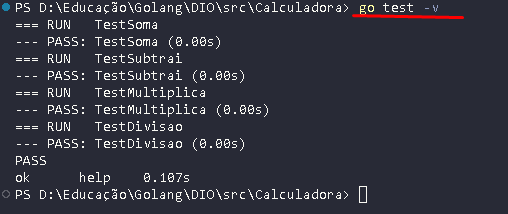

<h1>
    
    
Go Developers
</h1>

Calculadora com funções básicas de Soma, subtração, multiplicação e divisão. O grande projeto é o arquivo de Testes em esteira.

## Como chegar lá?

Sistema de teste usando biblioteca "testing", permite testar a calculadora de forma agil, com testes automatizados.

O objetivo foi alcançado, rodando o comando na linha de terminal "go test -v", conforme imagem abaixo:

]

## Insights 

O Teste em esteira , possibilita realizar testes em grandes escalas com parametros conhecidos, deixando assim a fase "pre-produção" mais perto e mais segura para o ambiente de produção.

- A estrutura do projeto é bem organizada e fácil de se navegar;
- O código possui um bom nível de qualidade;
- O projeto é bem estruturado e fácil de entender.

## Exemplos

Empresas que  utilizam Go:

    - Mercado Livre;
    - Itau;
    - Twitch;
    - Uber;
E a lista não para!

## Referência

 - [Documentação Oficial](https://go.dev/doc/)

 - [PlayGorund Go](https://go.dev/play/)
 
## 😊Autores

<h2>
    
    
    
    
    
</h2>

## 🚀 Sobre mim
Pai, ciclista e apaixonado por Tecnologia, atuo como Gerente multidisciplinar em uma empresa de engenharia e que nas horas vagas "gasto" meu tempo com programação e desafios na internet.

Programando marjoritariamente em Python, também especialista em banco de Dados, Analise de dados/Big Data e programador FullStack.

Recentemente, me deparei programando em Go, linguagem que mais cresce no mundo.
